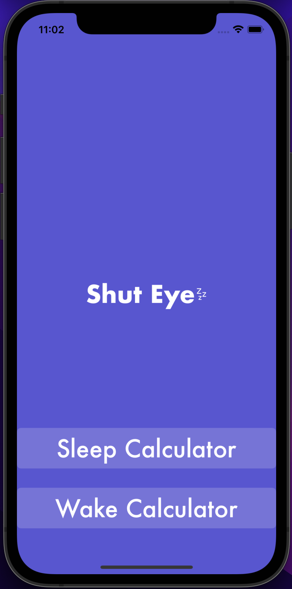
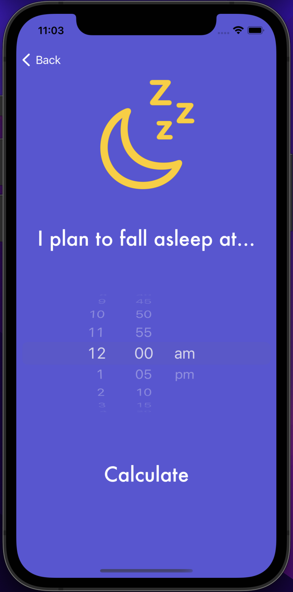
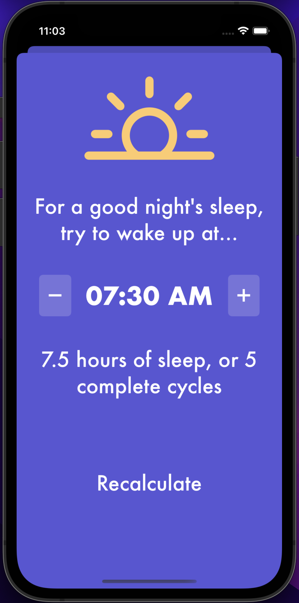
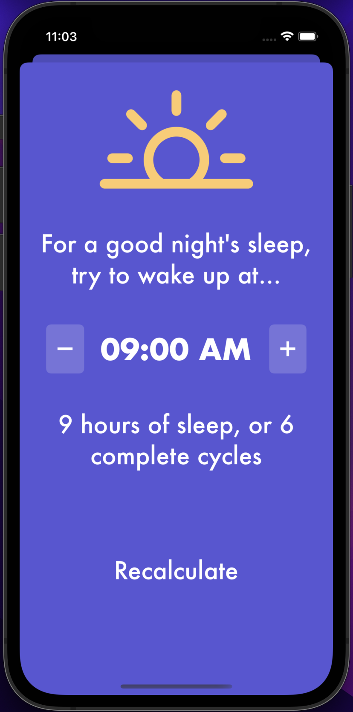
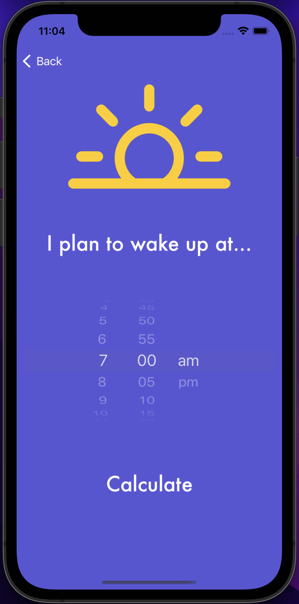
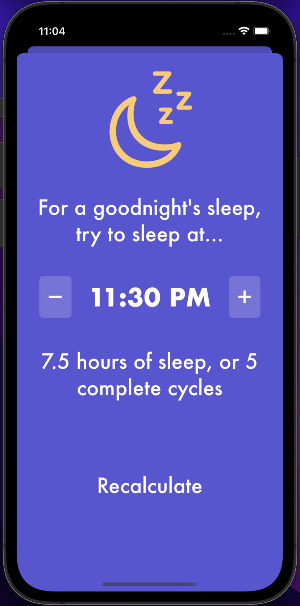
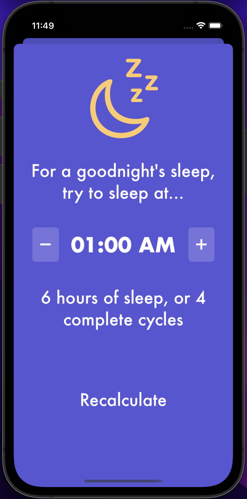

# About
Shut Eye is a sleep cycle calculator, aimed to give users a healthy good night sleep.
- Given a wake-up time, it will output the ideal time to fall asleep.
- Given a sleep time, it will output the ideal wake-up time.

This was a short 3 day challenge set to myself after completing <a href="https://www.udemy.com/course/ios-13-app-development-bootcamp/">Angela Yu's Swift Course</a>.

Heavily based on [Sleepopolis' sleep calculators](https://sleepopolis.com/calculators/sleep/) (previously known as SleepTime).

# Previews
## Home Screen

## Sleep Time Calculator

## Wake Up Time Calculator

